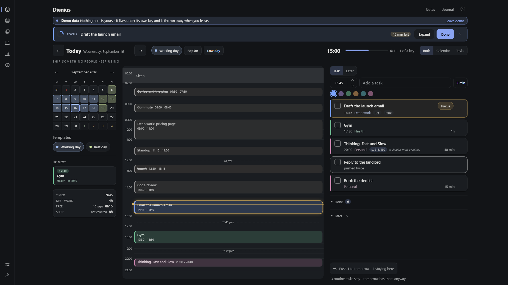
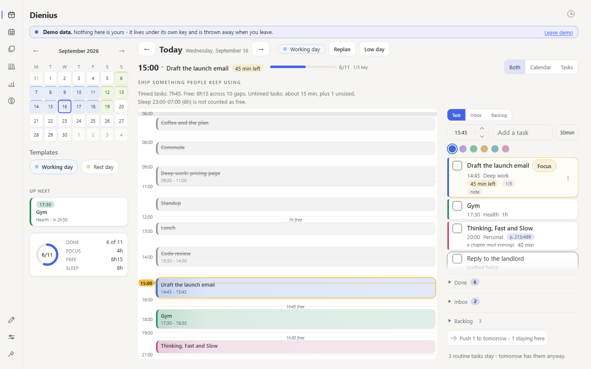
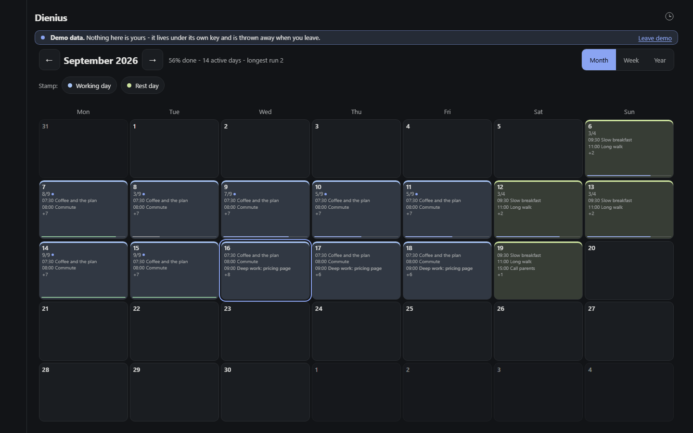
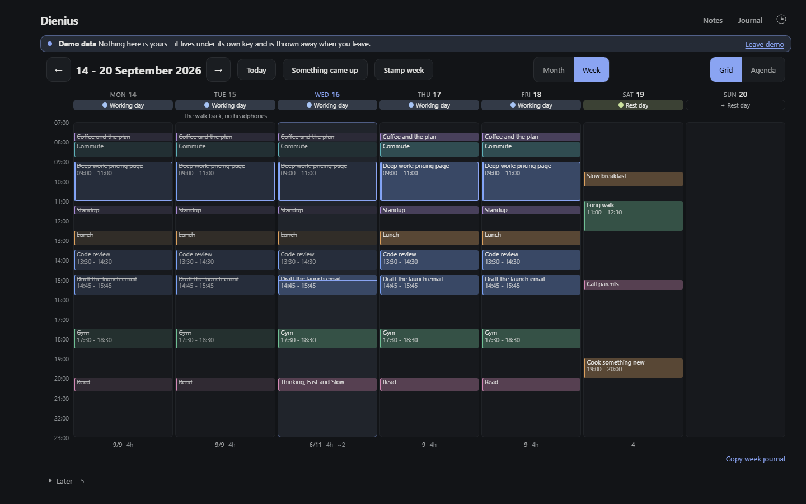
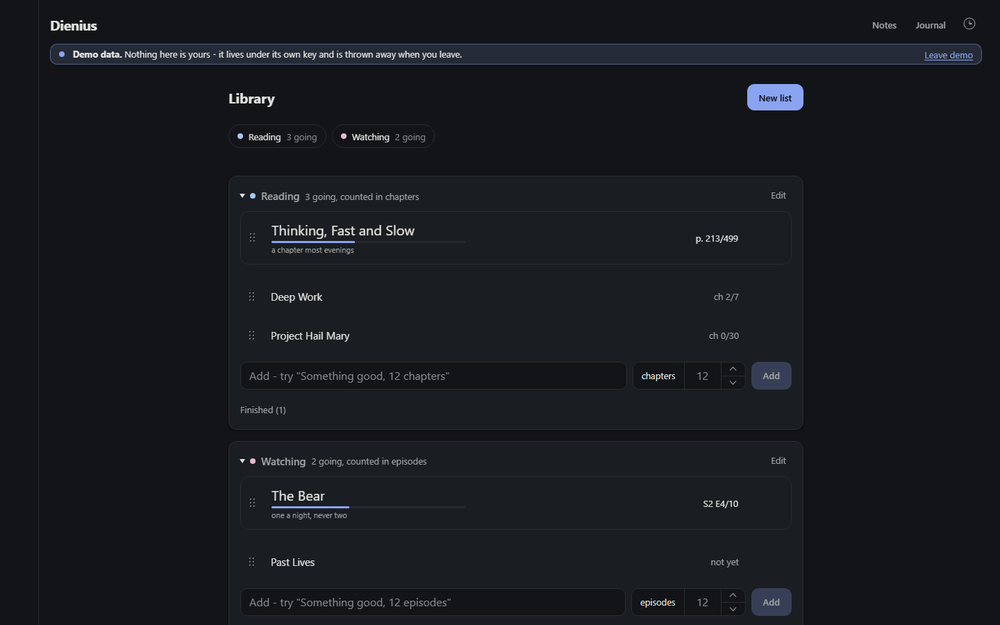
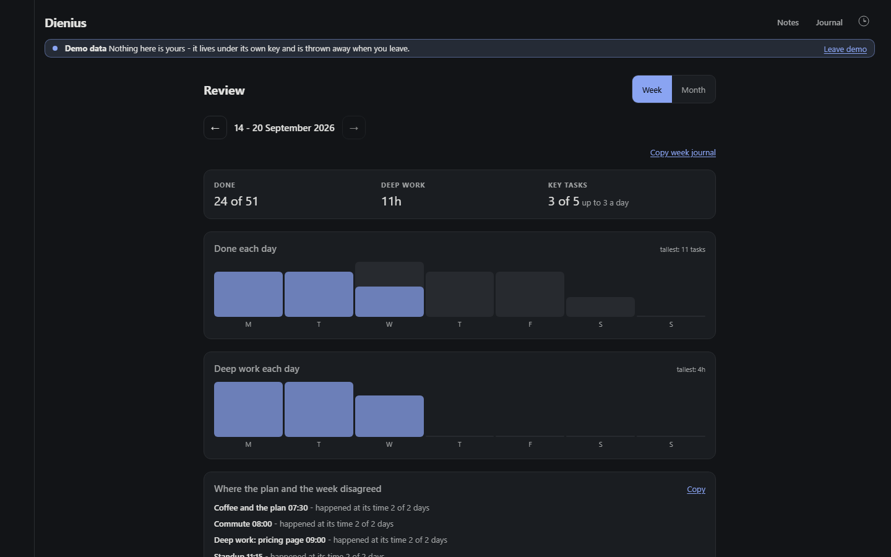
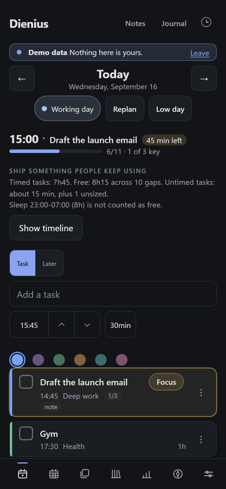

<h1 align="center">Dienius</h1>

<p align="center"></p>

<p align="center">A day planner for a brain that needs the plan to be visible, or it stops existing.</p>

<p align="center">
  <a href="https://quicasha.github.io/dienius/?demo=1"><strong>Try the demo</strong></a>
  &nbsp;·&nbsp;
  <a href="https://quicasha.github.io/dienius/">Open the app</a>
  &nbsp;·&nbsp;
  <a href="docs/DAILY.md">Set it up</a>
  &nbsp;·&nbsp;
  <a href="docs/ARCHITECTURE.md">How it is built</a>
</p>

<p align="center">
  <a href="LICENSE"></a>
  
  
  
  
</p>

<p align="center"><sub>The demo fills a sample fortnight under its own storage key and throws it away when you leave. It never touches a real plan.</sub></p>

## Install

- **iPhone / iPad** - open the link in Safari, then Share → Add to Home Screen
- **Android** - open it in Chrome, then ⋮ → Install app
- **Desktop** - Chrome and Edge show an install icon in the address bar

After that it runs full screen, works with no connection, and keeps its data on that device.

## What it does

- Stamps a **template** onto a day, so the morning does not start from a blank list
- Draws the day as a **timeline**, with free time labelled and a line at now
- Adds a task from one line: the time and the length are already filled in, you type the title
- **Replans** a broken day in one press: something came up, shift the rest, or away and back
- Keeps a **week view**, a **library** of books and series worked through a session at a time, and a **review** of how the weeks went
- Never scores a bad day against you: no points, no badges, no red, no streak on the day view

<table align="center">
  <tr>
    <td align="center"><br><sub><b>Today, light</b></sub></td>
    <td align="center"><br><sub><b>Month</b></sub></td>
    <td align="center"><br><sub><b>Week</b></sub></td>
  </tr>
  <tr>
    <td align="center"><br><sub><b>Library</b></sub></td>
    <td align="center"><br><sub><b>Review</b></sub></td>
    <td align="center"><br><sub><b>On a phone</b></sub></td>
  </tr>
</table>

<p align="center"><sub>Every image is made by <code>npm run shots</code> from the sample fortnight, with the clock pinned to the same Wednesday afternoon.</sub></p>

<details>
<summary><strong>The longer list</strong></summary>

- A template per weekday, so a new day opens already set up. A stamp by hand always wins
- Repeating tasks: daily, weekdays or weekly, made into real tasks you can tick and move
- Quick-add: a time control, the words, a length. "14:00 Call mom 45min" parses too, and the controls redraw to match
- Four shelves for what is not on the day: scratch (one key, nothing asked), an inbox, a backlog with no dates and no ages, and a float on a day with no time
- Push twice, then decide: an unfinished task moves to tomorrow twice, after that you finish it, drop it, or mark it ongoing
- What yesterday left, said once in a banner, moved forward in one tap, never on its own
- An evening close: one sentence about the day at a time you set, or when the last thing is ticked. It never mentions what was not done
- North: up to four directions with a why and no progress bar, one shown under the day's title
- Focus: the running task, its own planned time, a ring, a way out. Not a pomodoro
- A timer and a stopwatch that survive a refresh and run on every tab
- Task detail: exact minute, note, sub-steps, repeat, the three-a-day key mark
- Six categories, one colour each, the same on the card and on the timeline block
- Day types and core tasks, so a twelve-hour shift is not scored like an ordinary Tuesday
- Sleep as a named schedule, greyed on the grid and counted out of free time
- A month calendar that fits without scrolling, a year strip shaded by fullness
- External calendars as a read-only layer that free time counts: an .ics file needs nothing, a live feed needs the sync server to fetch it
- A keyboard layer with a card behind `?`, and Ctrl-K for commands and search
- A tour of nine steps, each ending when you actually do the thing
- Three themes - Dark, Light, Midnight - with every text token gated against every ground it sits on at WCAG AA, by a test
- Installs as a PWA, works offline, updates in the background with a quiet Reload notice

</details>

## Your data

The plan lives in `localStorage` on the device, as one JSON object; a few device-local preferences sit beside it under their own keys, and the daily snapshots in IndexedDB. Four ways it does not get lost:

- **Export and import** - Settings has a plain JSON backup, both ways. A backup from any earlier version still imports
- **Daily snapshots** - a full copy once a day in IndexedDB, the last seven kept, restorable from Settings
- **A copy on GitHub** - Settings → Backup takes a private repo and a fine-grained token, and writes the whole plan there as JSON after the day closes and on the first open of a new day. The token stays on the device. On a new phone, the same two fields and Restore from cloud bring everything back, after showing what it would replace
- **Sync between your devices** - optional, through a small server you host. Below

Deleting a task or a note, removing a library item, stamping a template, moving a block to another day and a replan can each be undone for five seconds.

<details>
<summary><strong>Sync between your devices</strong></summary>

There is no hosted service and no account. You run a server of under three hundred lines on a machine you own, and your devices copy changes through it.

```bash
node server/sync-server.mjs
```

On first run it writes `data/token.txt`, prints the token, and listens on port 8787. Options: `--port`, `--data <dir>`, and `--origin <url>` to allow an origin beyond localhost and `https://quicasha.github.io`.

On each device: Settings → Sync, paste the server address and that token, turn it on. It pulls when you open the app, pushes a couple of seconds after each change, and retries on its own when the connection comes back.

**From a phone**, do not open the port to the internet. Install [Tailscale](https://tailscale.com) on the PC and the phone, sign both into the same account, and put a certificate in front of the server:

```bash
tailscale serve --bg 8787
```

That prints an `https://your-pc.your-tailnet.ts.net` address, which is what goes in the server field. The address has to be https: the app is served over HTTPS, and a page on HTTPS is not allowed to call an HTTP endpoint.

**To run it at logon on Windows**, no window:

```bash
schtasks /create /tn "Dienius sync" /tr "node \"C:\path\to\dienius\server\sync-server.mjs\"" /sc onlogon /rl highest
```

Merging is per entity, so a morning on the phone and an evening on the PC both survive; the same task edited on both keeps the later edit. Deletes stick. If the server ever answers with something that is not a plan, nothing local is touched and Settings says so. Snapshots and the timer do not sync.

</details>

## Under the hood

React 19 and TypeScript, built with Vite. No UI framework, no router, no state library. The whole state is one object behind `useSyncExternalStore`, saved straight to `localStorage`. Everything that is not a component - parsing, sorting, scoring, stamping, capacity, the timeline's geometry, iCalendar - is a plain function in `src/lib` or beside its widget, tested directly.

- `src/lib` holds the data model (`types.ts`), the store (`store.ts`, ten area modules under `store/`), the storage boundary and its validator, sync, the calendar reader, the tour as data
- `src/widgets/day-plan` is the day view: quick-add, the timeline grid, capacity, replan, the task detail sheet
- `src/views` is every other tab, the week view, the tour engine, the shared controls
- `server/sync-server.mjs` is the optional sync server; `scripts/` builds the service worker's cache list and the README's screenshots

The suite is Vitest and Testing Library for the pure modules and the views, and Playwright against the production build for the flows that cross tabs. Every push and pull request runs the tests and the build; a push to `main` also publishes to GitHub Pages when both pass. The browser tests run in a job of their own.

The map of the whole thing is [`docs/ARCHITECTURE.md`](docs/ARCHITECTURE.md).

## Run locally

```bash
npm install
npm run dev       # dev server at localhost:5173
npm test          # vitest, watch mode
npm run e2e       # playwright against the production build (npx playwright install chromium, once)
npm run shots     # the README's screenshots, from the demo under a pinned clock
npx tsc --noEmit  # typecheck
npm run build     # typecheck, build, then generate the service worker
```

Requires Node 22 or newer.

## Docs

- [`docs/DAILY.md`](docs/DAILY.md) - for using it rather than building it: setting it up once, and what to do if something looks wrong
- [`docs/STATE.md`](docs/STATE.md) - where the project is: every feature in a line, what is owed, what will bite you
- [`docs/ARCHITECTURE.md`](docs/ARCHITECTURE.md) - where the code is: the data model, the state flow, which file for which job
- [`docs/CONVENTIONS.md`](docs/CONVENTIONS.md) - how work is done here, and why each rule exists
- [`docs/DECISIONS.md`](docs/DECISIONS.md) - the harder calls, with what each one costs
- [`docs/RESEARCH-ADHD.md`](docs/RESEARCH-ADHD.md) - the evidence behind the push rule and the if-then board, and what not to build

## License

[MIT](LICENSE).
