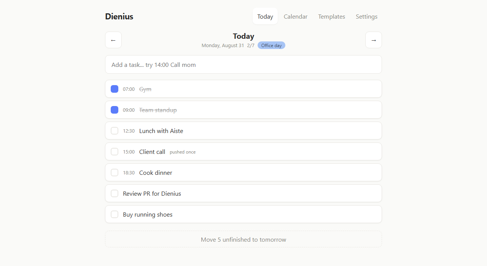
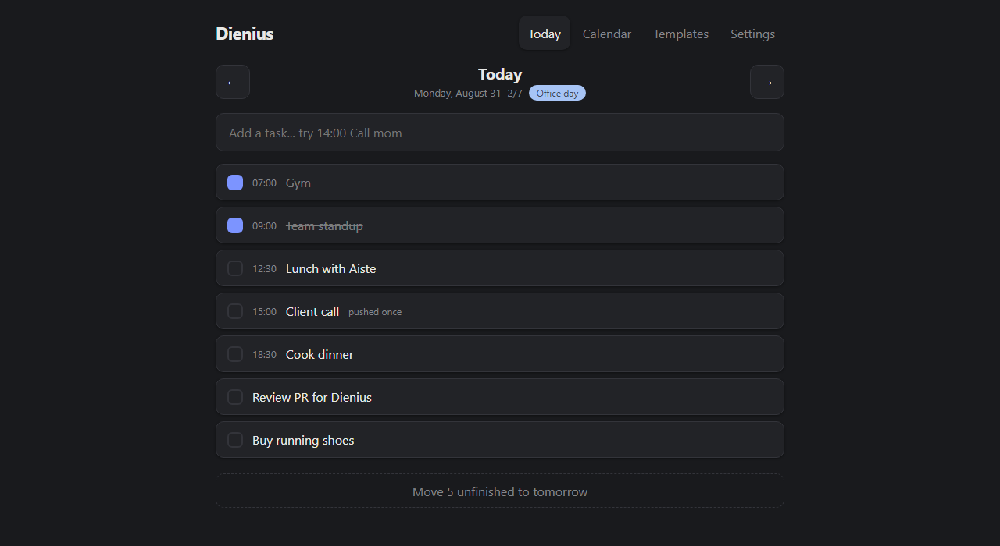
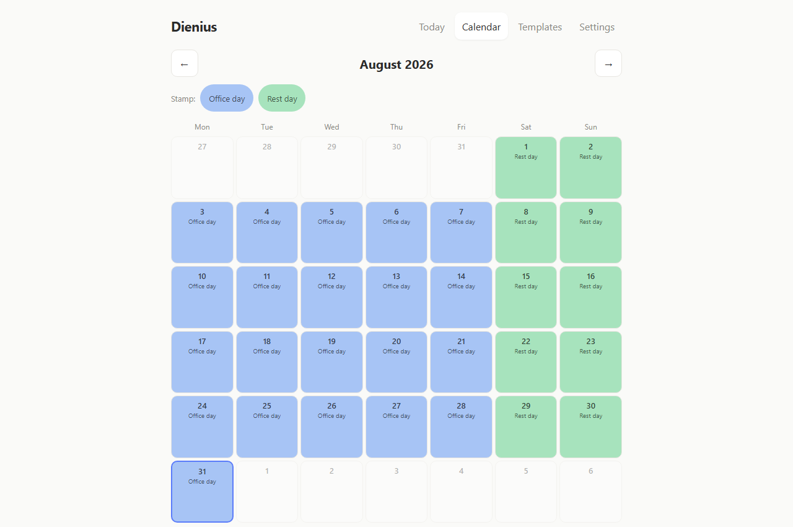
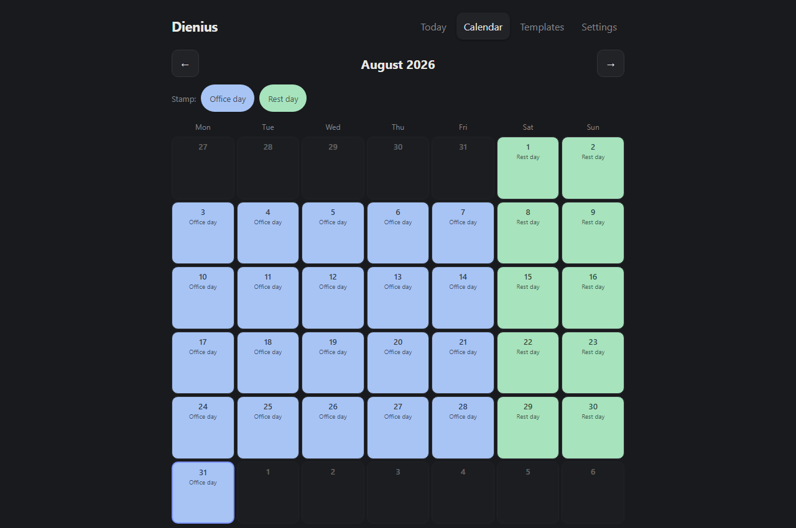
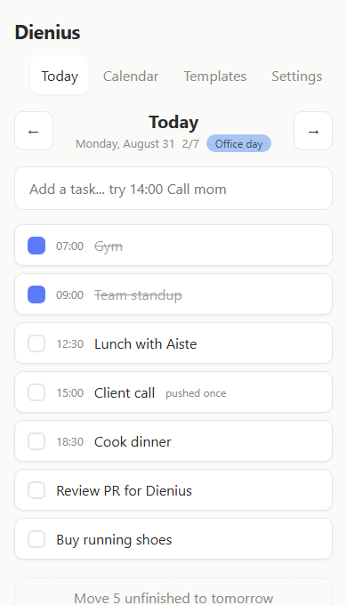
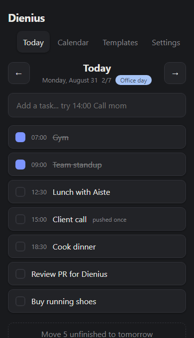
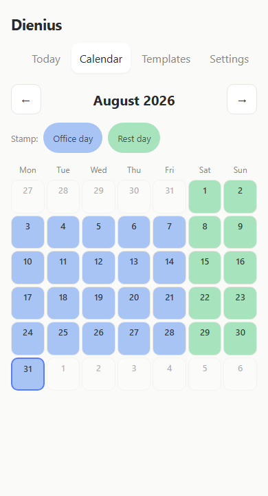
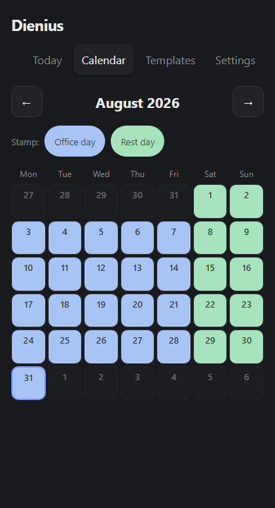

# Dienius

A day planner built around reusable day templates, for people whose plan needs to be visible or it
stops existing. No accounts, no server, no streaks. Everything lives in the browser.

**Live app: [quicasha.github.io/dienius](https://quicasha.github.io/dienius/)**

<table>
<tr>
<td></td>
<td></td>
</tr>
<tr>
<td></td>
<td></td>
</tr>
</table>

<details>
<summary>On a phone</summary>
<p>




</p>
</details>

## What it does

**Templates, stamped onto days.** A template is a named, coloured list of time blocks - "Office
day," "Rest day," whatever a person's week actually looks like. Building one is just adding blocks
with a time and a title. On the calendar, picking a template and then clicking or dragging across
dates paints it onto those days; nothing commits until Save, so a drag across the wrong week is
just Cancel, not cleanup.

A template also carries a day type - full, shift, night, or rest - because a twelve-hour shift and
an ordinary Tuesday aren't the same kind of day and shouldn't be measured as if they were. On
anything but a full day, a block can be marked core: something that genuinely has to happen, as
opposed to everything else that might.

**A day view built for one thing: right now.** One input adds a task, with an optional leading time
("`14:00 Call mom`") to keep it at the top of the list. One tap finishes it. There's no priority
field, no tags, no due-date picker - the fewer decisions between opening the app and a task
existing on today, the more likely it actually gets typed in.

**An if-then board for the moments that repeat.** An implementation intention is a trigger and a
response decided ahead of time - "if I get home and the kitchen is a mess, then I set a timer for
ten minutes and do only the sink" - so there is nothing left to decide once the trigger actually
happens. Each entry is just that pair plus an optional colour tag, shown as a card with the trigger
leading since that is what gets scanned for in the moment. There is no done checkbox and nothing
counts how often one fired - it isn't a task, and measuring it would turn a coping tool into
another thing to fail at.

**A push rule with a real edge to it.** An unfinished task can be pushed to tomorrow, and pushed
again - twice, and no further. On the third day, it stops offering "push" and instead asks
directly: finish it, or let it go. The delete button on a task at that point is framed as a
decision that's fine either way, not a failure state. The alternative - infinite rollover - is how
a todo list turns into a graveyard of things from three weeks ago that nobody's going to do.

**A score with nothing riding on it.** Next to the date, a plain fraction - done over planned for
that day, nothing else. No percentage, no weekly average, no streak. A day with no plan shows no
score at all, because there's nothing to measure - not a "0/0" quietly implying failure for a day
that was never engaged with in the first place. On a shift, night, or rest day, the fraction counts
only the tasks marked core, with a quiet label saying so - so a twelve-hour shift with one required
block and a handful of optional ones scores against that one block, not against a full day's worth
of tasks it never had room for.

**A year strip, without the streak.** The calendar tab has a Month/Year switch; Year shows a row of
one cell per day, colored by that day's template, scrolling sideways on a phone rather than shrinking
to fit. A cell only carries two signals: color, if the day had a plan, and a thin ring, if everything
planned for that day got done - a day attempted but not finished looks exactly like a day just
stamped and not yet touched, on purpose. An unplanned day is a plain neutral tile, the same as any
other empty stretch on the grid, not a hole or a warning color. There's no total, no percentage, and
nothing counting days in a row - see [`docs/DECISIONS.md`](docs/DECISIONS.md) for why a grid like
this is the easiest feature in the app to get wrong.

**Backup that's explicit.** Settings has an export and an import, both plain JSON. There's no
account to lose access to and no sync to silently fail - just a file, made on purpose, that a
person actually has.

**Works with the network off.** Installable as a PWA, with a service worker that caches the app
shell so it opens the same way whether the connection is there or not.

**Light and dark**, switched in Settings, no flash of the wrong one on load.

## Why it's built this way

The premise underneath all of this: a plan that isn't visible doesn't exist, and a tool that
demands upkeep gets abandoned within a week. Every constraint above follows from one of those two
sentences.

Templates instead of recurring-task rules because "every weekday at 9" is a rule that eventually
meets a week that doesn't fit it, and reconciling the exception is exactly the kind of maintenance
that gets a planner shelved. A template stamped by hand stays honest about what's actually true
for that day, at the cost of a bit more clicking than a rule would need.

The push rule stops at two because unlimited rollover isn't forgiveness, it's a way for a task to
never have to be looked at again. A hard stop forces a decision - which, done or deleted, is
progress either way - instead of letting a task drift for a month feeling technically still
"planned."

No streaks, and no score without a plan, for the same reason: a streak converts one off day into a
reason to quit entirely, and a "0/0" for a day nobody opened the app is punishing absence as if it
were failure. Both patterns are common in habit apps because they're effective at driving daily
opens. They're also exactly wrong for someone whose days are already inconsistent by nature - the
tool should absorb that inconsistency, not penalize it.

No accounts and no backend because a login screen is friction between a person and the plan they
need to see *now*, and because the whole feature set fits in one JSON blob with no server-side
logic behind it - a backend would be infrastructure serving no purpose the browser doesn't already
serve. The trade-offs of that choice, and the others above, are written out honestly - including
the parts that cost something - in [`docs/DECISIONS.md`](docs/DECISIONS.md).

## Stack and running it locally

React 19 and TypeScript, built with Vite. No UI framework, no state management library - app state
is one object behind a `useSyncExternalStore` store (`src/lib/store.ts`), persisted straight to
`localStorage`. No backend of any kind.

```bash
npm install
npm run dev       # dev server at localhost:5173
npm test          # vitest, watch mode
npx tsc --noEmit  # typecheck
npm run build     # typecheck, build, then generate the service worker
```

Requires Node 22 or newer (see `.nvmrc`).

## How the code is organized

```
src/
  lib/          data model, persistence, the app store, and small pure helpers
    types.ts       AppData, Template, Task, DayPlan, Settings
    storage.ts      load/save/validate against localStorage, export/import JSON
    store.ts         the actions (addTask, rolloverUnfinished, stamp, ...) and the push-rule bound
    stamping.ts      turns a template + a set of picked dates into day plans
    dates.ts         date-key helpers and the calendar month grid
    theme-color.ts   keeps <meta name="theme-color"> in sync with the active theme
    colors.ts        the one named colour palette, shared by templates and if-then tags
  views/        the four full-page views: Calendar, Templates, Settings (Day lives in widgets/)
  widgets/
    day-plan/     the day view and its own pure modules: quick-add parsing, sort order,
                  draft autosave, and the day-score calculation
    if-then/      the if-then board, a second widget on the day view
    year-strip/   the year-at-a-glance strip shown from the calendar tab, and the pure
                  module that turns stored days into a year's worth of colored cells
    registry.ts    which widgets are enabled and shown on the day view
  App.tsx       tab navigation and the current view/date
scripts/
  generate-sw.mjs   runs after the production build; hashes the output and writes the
                    versioned cache name and precache list into public/sw.js
public/
  manifest.webmanifest, icons/, sw.js   PWA assets
```

Logic that doesn't need a component - parsing, sorting, scoring, stamping, date math - is written
as plain, independently tested functions rather than folded into the components that call them.

## Testing and deployment

194 tests across the codebase, run with `npm test` (Vitest, jsdom, Testing Library). They cover the
pure logic modules directly and the views through user-facing interaction rather than
implementation detail.

Every push to `main` runs the full test suite, then builds - which typechecks before it bundles -
and only deploys if both steps succeed. The build output goes to GitHub Pages via the workflow in
`.github/workflows`.

## License

[MIT](LICENSE).

---

What's not built yet, and why, is tracked in [`docs/BACKLOG.md`](docs/BACKLOG.md).
