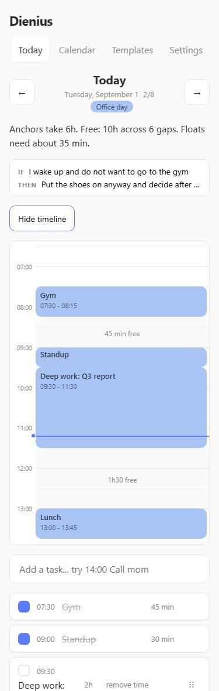
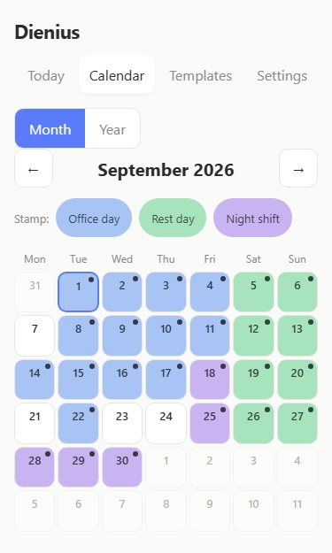
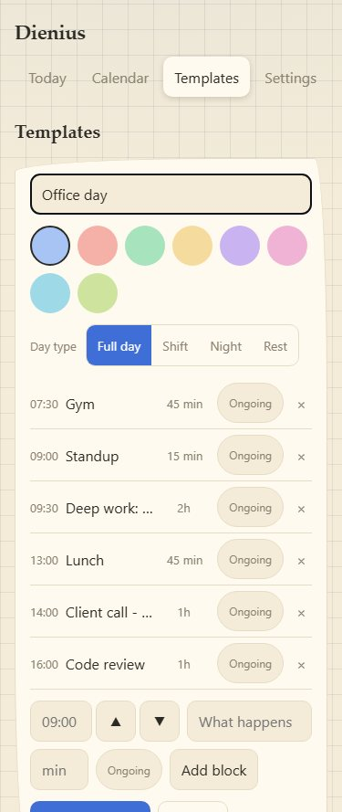
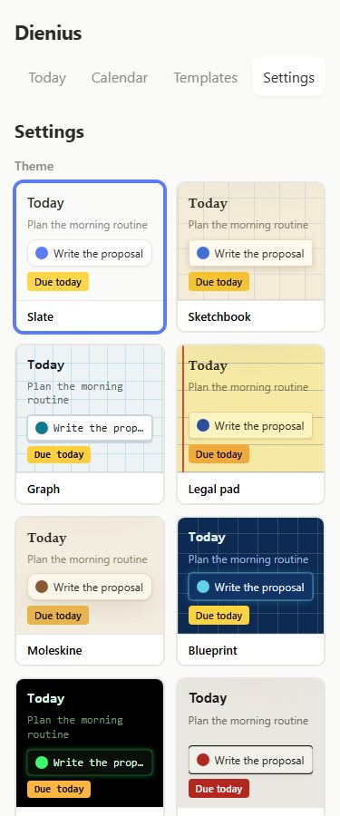
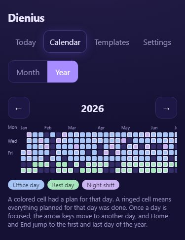
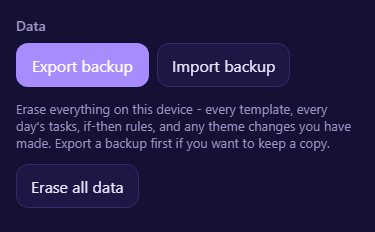

<h1 align="center">Dienius</h1>

<p align="center">A day planner for a brain that needs the plan to be visible or it stops existing. No account, no server, no streaks.</p>

<p align="center"><a href="https://quicasha.github.io/dienius/"><strong>Open the app</strong></a></p>

<p align="center">
  <a href="LICENSE"></a>
  
  
</p>

<details>
<summary><b>See it in action</b> - a working day, a stamped month, eleven themes</summary>
<br>
<table>
  <tr>
    <td align="center"><br><sub><b>Today</b></sub></td>
    <td align="center"><br><sub><b>Calendar</b></sub></td>
    <td align="center"><br><sub><b>Templates</b></sub></td>
  </tr>
  <tr>
    <td align="center"><br><sub><b>Themes</b></sub></td>
    <td align="center"><br><sub><b>Year</b></sub></td>
    <td align="center"><br><sub><b>Settings</b></sub></td>
  </tr>
</table>
</details>

---

## Install

- **iPhone** - open the link in Safari → **Share** → **Add to Home Screen**
- **Android** - open it in Chrome → **⋮** → **Install app**

Takes half a minute. After that it runs full-screen and works fully offline.

## What it does

- Reusable day templates - a named, colored set of time blocks stamped onto calendar dates by clicking or dragging; nothing commits until you save
- A capacity line - one sentence saying whether today fits: what's anchored, how much free time is left across how many gaps, what the floats still need
- A day timeline - anchored tasks at their real time and size, free gaps drawn as labeled regions, a line marking right now; collapsed until you open it
- Push twice, then decide - an unfinished task can move to tomorrow twice; after that it's finish it, delete it, or mark it ongoing
- A score with nothing riding on it - done over planned for today, nothing else; no percentage, no streak, no score on a day with no plan
- Day types and core tasks, so a twelve-hour shift isn't scored like an ordinary Tuesday
- If-then rules on the day view - one shown at a time, matched to the day's type and the time of day
- A year strip - one cell per day, colored by template, a thin ring when everything planned got done
- Eleven themes, light and dark - each a full palette, with per-theme overrides and a contrast check built into the test suite

## Your data

Everything is written straight to `localStorage`. There's no account and no server to lose access to.

- **Export / Import** - Settings has a plain JSON backup, both ways. It's a deliberate manual step, not an automatic one - a backup only exists when you actually made it
- No sync between devices - clear site data on this one and it's gone unless you exported first
- Updates install themselves the next time you open the app

---

## Under the hood

React 19 and TypeScript, built with Vite. No UI framework, no state management library - app state is one object behind a `useSyncExternalStore` store, persisted straight to `localStorage`. No backend of any kind.

```
src/
  lib/
    types.ts         AppData, Template, Task, DayPlan, Settings, IfThenEntry
    storage.ts       load/save/validate against localStorage, export/import JSON
    store.ts         the actions - addTask, stamp, rolloverUnfinished - and the push bound
    stamping.ts      turns a template plus a set of picked dates into day plans
    dates.ts         date-key helpers and the calendar month grid
    colors.ts        the one color palette, shared by templates and if-then tags
    themes.ts        the eleven theme presets, light and dark variants of each
    theme.ts         resolves a preset plus its overrides into real CSS values
    theme-color.ts   keeps <meta name="theme-color"> in sync with the active theme
    contrast.ts      the WCAG contrast gate the override panel and tests both run
    pushRules.ts     the two-push bound and the ongoing exemption
  views/          Calendar, Templates, Settings, ThemeGallery, ThemeOverridePanel
  widgets/
    day-plan/     the day view: quick-add, sort order, capacity, the timeline grid, drag and drop, the score
    if-then/      the if-then board and its day-type/time-of-day rotation
    year-strip/   the year-at-a-glance strip and the module that colors it
    registry.ts   which widgets are enabled on the day view
  App.tsx         tab navigation and the current view/date
scripts/
  generate-sw.mjs   runs after the production build; hashes the output and writes the
                    versioned cache name and precache list into public/sw.js
public/
  manifest.webmanifest   PWA manifest
  icons/                 app icons, including the maskable one
  sw.js                  hand-rolled; generate-sw.mjs writes its cache name and precache list
```

Logic that doesn't need a component - parsing, sorting, scoring, stamping, capacity, date math - is written as plain, independently tested functions rather than folded into the components that call them. 750 tests, run with Vitest and Testing Library, covering the pure modules directly and the views through user-facing interaction.

The service worker in `public/sw.js` is hand-written rather than generated, and `scripts/generate-sw.mjs` versions its cache from a hash of the build output on every deploy, so an installed copy never gets stuck on stale files.

The reasoning behind the harder calls - why templates instead of recurring tasks, why the push bound stops at two, why there's no streak anywhere - is written out, including what each one costs, in [`docs/DECISIONS.md`](docs/DECISIONS.md). The evidence behind the if-then board and the push rule, and what the research says not to build, is in [`docs/RESEARCH-ADHD.md`](docs/RESEARCH-ADHD.md).

## Run locally

```bash
npm install
npm run dev       # dev server at localhost:5173
npm test          # vitest, watch mode
npx tsc --noEmit  # typecheck
npm run build     # typecheck, build, then generate the service worker
```

Requires Node 22 or newer (see `.nvmrc`).

**Deploy** - push to `main`. GitHub Actions runs the full test suite, then builds - which typechecks before it bundles - and only publishes to GitHub Pages if both steps succeed. Workflow in `.github/workflows/deploy.yml`.

## License

[MIT](LICENSE).
